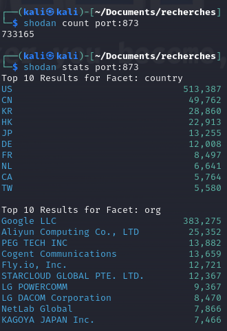
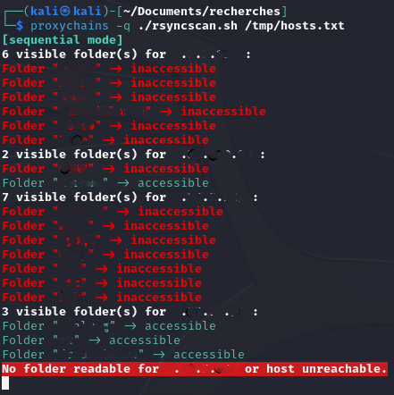
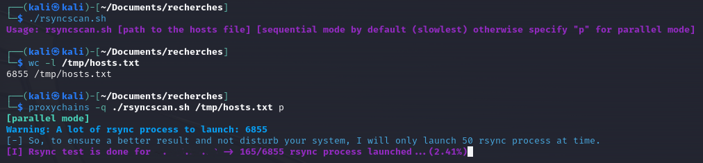
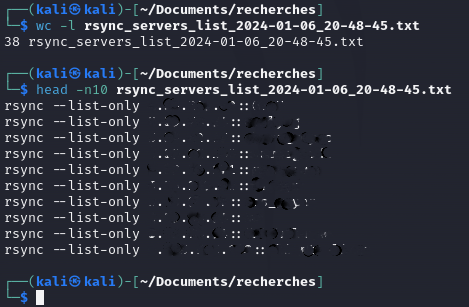

# RsyncScan

# Description
Nmap only allows for brute-force attempts or listing visible Rsync modules for a given host, but it doesn't indicate whether they are anonymously accessible (similar to what smb-enum-shares does for SMB).

This Bash script scans a large list of hosts in parallel (adjustable) using Rsync for remote synchronization, **identifying visible modules accessible**, at least **in anonymous read mode**.

This could be useful during internal/external pentesting to assess the level of protection.

**Disclaimer: This is an educational tool; I am not responsible for its use. You are solely responsible for your actions.**

# Statistics
We can see below with Shodan that there are a significant number of servers listening on TCP port 873 on the Internet, which is the default port for the Rsync service (not counting those listening on non-standard ports).
Approximately ~70% are in the US, and over 50% are associated with Google (which includes public servers in the count of course).

# Usage of the script:

Simply launch the script with the parameter being the **file containing the list of hosts to scan (IP addresses or hostnames, one per line)**.
By default, it runs in **sequential mode** (one host at a time, slower) with results displayed on the screen like this:

The **second mode is much faster as it scans hosts in parallel** (default is "50") with the letter "p", and you can **track the progress (in percentage)**:

In both cases, once completed, a **file will be generated containing all vulnerable hosts** (or not if it's a public server = intentional) with the accessible modules (rsync command):

